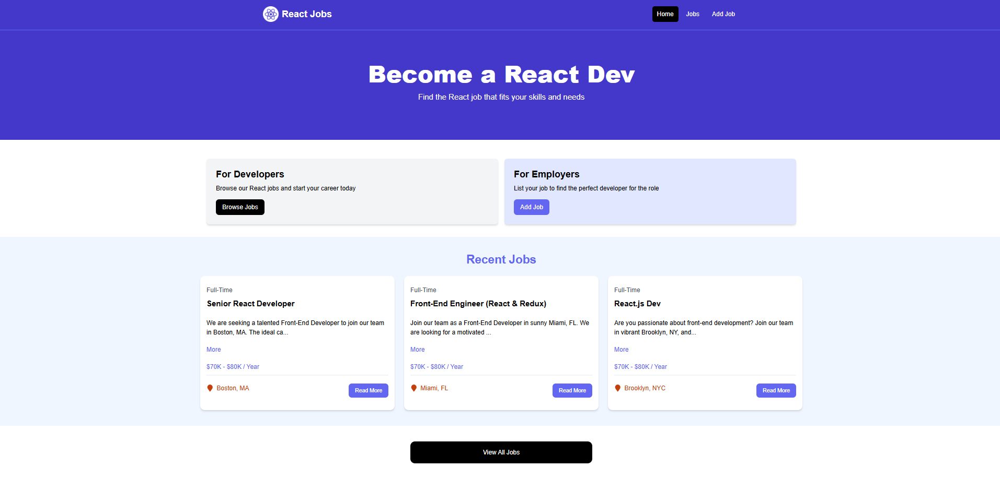
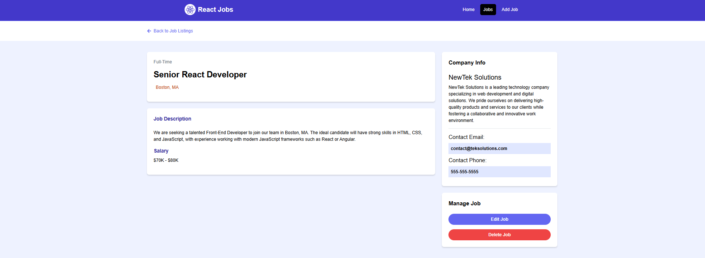

# 🚀 React Jobs - A Job Marketplace

A **React-based job marketplace** where employers can post job listings and job seekers can browse and apply. Built with modern web technologies including **React**, **Vite**, and **Tailwind CSS**.

## 📌 Technologies Used
- **React** `^18.3.1`
- **Vite** `^6.0.5`
- **Tailwind CSS** `^3.4.17`
- **JSON Server** (for simulating backend)

---
📷 Screenshots



---

## 📦 Project Setup

### 1️⃣ Clone the Repository
```sh
git clone https://github.com/L3pereira/react-jobs.git
cd react-jobs
```
### 2️⃣ Install Dependencies

```sh
npm install
```

###  3️⃣Start the Fake API Server

Since the project uses json-server to simulate a backend, run:

```sh
npm run server
```

The fake API will be available at http://localhost:8000

### 4️⃣ Run the Development Server
Start the React app using Vite:

```sh
npm run dev
```
The app will be available at http://localhost:3000

---

## ⚙️ Configuration (Vite Proxy Setup)
The project uses Vite's proxy to forward API requests to the fake JSON server:


```js
server: {
  port: 3000,
  proxy: {
    '/api': {
      target: 'http://localhost:8000',
      changeOrigin: true,
      rewrite: (path) => path.replace(/^\/api/, '')
    }
  }
}

```
This allows frontend requests like fetch('/api/jobs') to be forwarded to http://localhost:8000/jobs

---

## 📜 Available Scripts

| Script          | Description                               |
|----------------|-------------------------------------------|
| `npm run dev`  | Starts the development server (Vite)     |
| `npm run build` | Builds the project for production       |
| `npm run preview` | Serves the production build           |
| `npm run server` | Starts the JSON Server (backend simulation) |
| `npm run lint` | Runs ESLint to check for code issues     |
